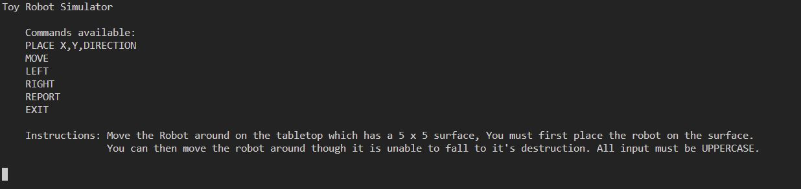
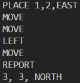

# Toy Robot Challenge

## By Clinton Forster

### This is my version of the Toy Robot Challenge made as a terminal app with Ruby 2.5.5 using Visual Studio Code.

Github Repository: https://github.com/The4star/toy_robot

## Challenge Directions

Create a library that can read in commands of the following form:

##### PLACE X,Y,DIRECTION
##### MOVE
##### LEFT
##### RIGHT
##### REPORT

* The library allows for a simulation of a toy robot moving on a 5 x 5 square tabletop.
* There are no obstructions on the table surface.
* The robot is free to roam around the surface of the table, but must be prevented from falling to destruction. Any movement that would result in this must be prevented, however further valid movement commands must still be allowed.
* PLACE will put the toy robot on the table in position X,Y and facing NORTH, SOUTH, EAST or WEST.
* (0,0) can be considered as the SOUTH WEST corner and (4,4) as the NORTH EAST corner.
* The first valid command to the robot is a PLACE command. After that, any sequence of commands may be issued, in any order, including another PLACE command. The library should discard all commands in the sequence until a valid PLACE command has been executed.
* The PLACE command should be discarded if it places the robot outside of the table surface.
* MOVE will move the toy robot one unit forward in the direction it is currently facing.
* LEFT and RIGHT will rotate the robot 90 degrees in the specified direction without changing the position of the robot.
* REPORT will announce the X,Y and orientation of the robot.
* A robot that is not on the table can choose to ignore the MOVE, LEFT, RIGHT and REPORT commands.
* The library should discard all invalid commands and parameters.

## Usage

1. Download or Clone the repository
2. Change to the lib (library) directory
```ruby
$ cd lib/
```
3. Run the app.rb file
```ruby
$ ruby app.rb
```
4. You will be greeted by the introductory screen explaining the input options:



5. You can then use the input options to PLACE, MOVE, REPORT, turn LEFT, turn RIGHT or EXIT the application.

### Examples of expected input and output:




